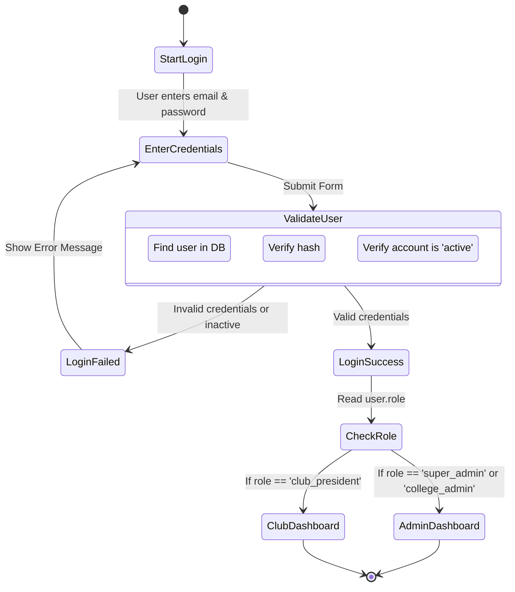

# Activity Diagram: User Login & Role Routing

```mermaid
stateDiagram-v2
    [*] --> StartLogin
    StartLogin --> EnterCredentials: User enters email & password
    EnterCredentials --> ValidateUser: Submit Form
    
    state ValidateUser {
        CheckEmail: Find user in DB
        CheckPassword: Verify hash
        CheckStatus: Verify account is 'active'
    }
    
    ValidateUser --> LoginFailed: Invalid credentials or inactive
    LoginFailed --> EnterCredentials: Show Error Message
    
    ValidateUser --> LoginSuccess: Valid credentials
    
    LoginSuccess --> CheckRole: Read user.role
    
    CheckRole --> AdminDashboard: If role == 'super_admin' or 'college_admin'
    CheckRole --> ClubDashboard: If role == 'club_president'
    
    AdminDashboard --> [*]
    ClubDashboard --> [*]
```
