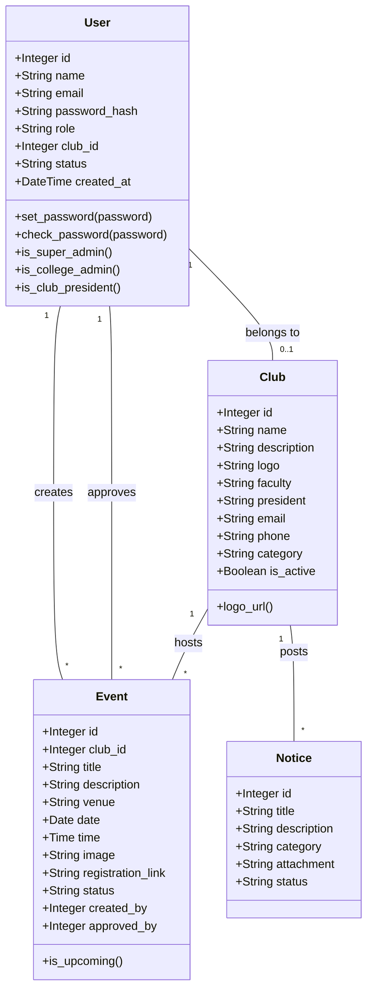

# Class Diagram

```mermaid
classDiagram
    class User {
        +Integer id
        +String name
        +String email
        +String password_hash
        +String role
        +Integer club_id
        +String status
        +DateTime created_at
        +set_password(password)
        +check_password(password)
        +is_super_admin()
        +is_college_admin()
        +is_club_president()
    }

    class Club {
        +Integer id
        +String name
        +String description
        +String logo
        +String faculty
        +String president
        +String email
        +String phone
        +String category
        +Boolean is_active
        +logo_url()
    }

    class Event {
        +Integer id
        +Integer club_id
        +String title
        +String description
        +String venue
        +Date date
        +Time time
        +String image
        +String registration_link
        +String status
        +Integer created_by
        +Integer approved_by
        +is_upcoming()
    }

    class Notice {
        +Integer id
        +String title
        +String description
        +String category
        +String attachment
        +String status
    }

    User "1" -- "0..1" Club : belongs to
    User "1" -- "*" Event : creates
    User "1" -- "*" Event : approves
    Club "1" -- "*" Event : hosts
    Club "1" -- "*" Notice : posts
```
