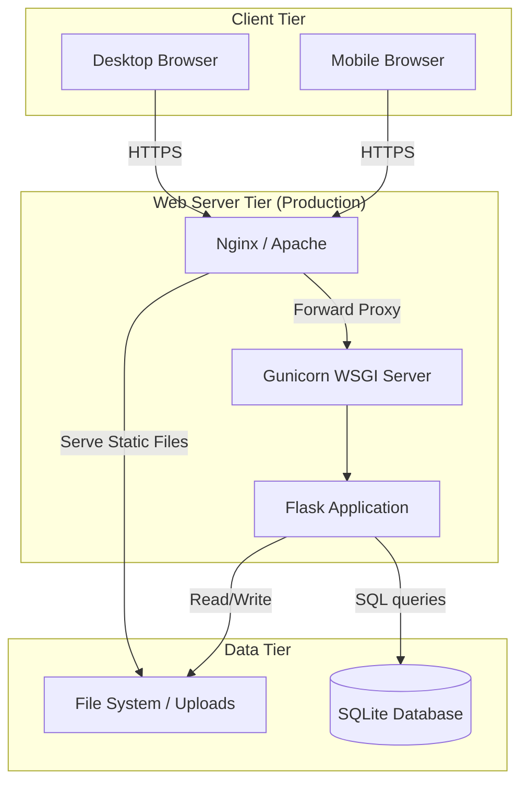

# Deployment Diagram

```mermaid
graph TD
    subgraph "Client Tier"
        Browser1[Desktop Browser]
        Browser2[Mobile Browser]
    end

    subgraph "Web Server Tier (Production)"
        ReverseProxy[Nginx / Apache]
        WSGI[Gunicorn WSGI Server]
        FlaskProcess[Flask Application]
    end

    subgraph "Data Tier"
        Filesystem[File System / Uploads]
        DB[(SQLite Database)]
    end

    Browser1 -->|HTTPS| ReverseProxy
    Browser2 -->|HTTPS| ReverseProxy
    
    ReverseProxy -->|Forward Proxy| WSGI
    ReverseProxy -->|Serve Static Files| Filesystem
    
    WSGI --> FlaskProcess
    
    FlaskProcess -->|Read/Write| Filesystem
    FlaskProcess -->|SQL queries| DB
```
