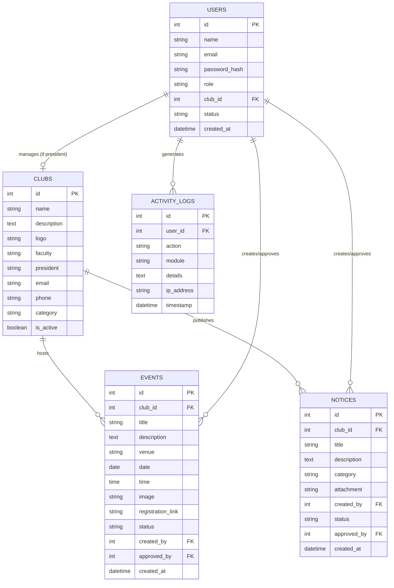

# Entity Relationship (ER) Diagram

```mermaid
erDiagram
    USERS {
        int id PK
        string name
        string email
        string password_hash
        string role
        int club_id FK
        string status
        datetime created_at
    }

    CLUBS {
        int id PK
        string name
        text description
        string logo
        string faculty
        string president
        string email
        string phone
        string category
        boolean is_active
    }

    EVENTS {
        int id PK
        int club_id FK
        string title
        text description
        string venue
        date date
        time time
        string image
        string registration_link
        string status
        int created_by FK
        int approved_by FK
        datetime created_at
    }

    NOTICES {
        int id PK
        int club_id FK
        string title
        text description
        string category
        string attachment
        int created_by FK
        string status
        int approved_by FK
        datetime created_at
    }

    ACTIVITY_LOGS {
        int id PK
        int user_id FK
        string action
        string module
        text details
        string ip_address
        datetime timestamp
    }

    USERS ||--o| CLUBS : "manages (if president)"
    CLUBS ||--o{ EVENTS : "hosts"
    CLUBS ||--o{ NOTICES : "publishes"
    USERS ||--o{ EVENTS : "creates/approves"
    USERS ||--o{ NOTICES : "creates/approves"
    USERS ||--o{ ACTIVITY_LOGS : "generates"
```
