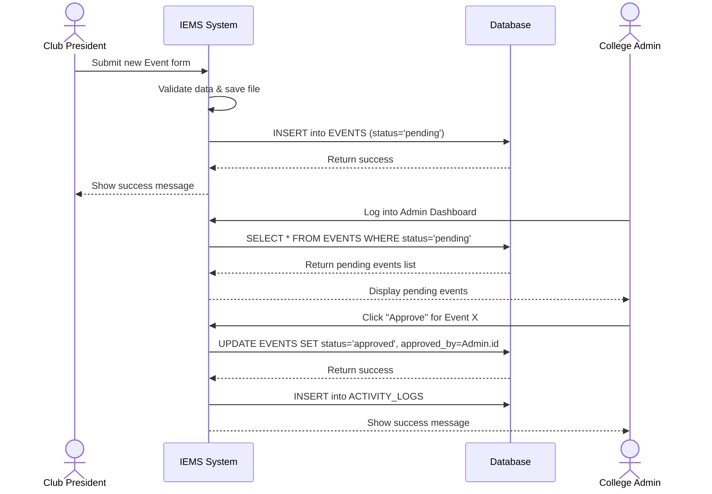

# Sequence Diagram: Event Approval Workflow

```mermaid
sequenceDiagram
    actor ClubPres as Club President
    participant Sys as IEMS System
    participant DB as Database
    actor Admin as College Admin

    ClubPres->>Sys: Submit new Event form
    Sys->>Sys: Validate data & save file
    Sys->>DB: INSERT into EVENTS (status='pending')
    DB-->>Sys: Return success
    Sys-->>ClubPres: Show success message

    Admin->>Sys: Log into Admin Dashboard
    Sys->>DB: SELECT * FROM EVENTS WHERE status='pending'
    DB-->>Sys: Return pending events list
    Sys-->>Admin: Display pending events

    Admin->>Sys: Click "Approve" for Event X
    Sys->>DB: UPDATE EVENTS SET status='approved', approved_by=Admin.id
    DB-->>Sys: Return success
    Sys->>DB: INSERT into ACTIVITY_LOGS
    Sys-->>Admin: Show success message
```
